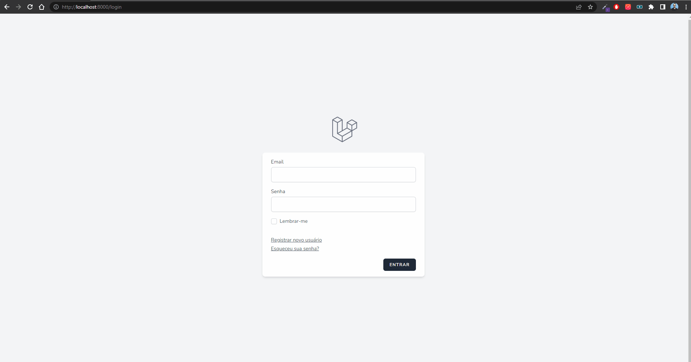

## Gerenciador de séries

Um gerenciador de séries assistidas, desenvolvido com o framework Laravel. 
O usuário pode cadastrar o nome da série, a quantidade de temporadas e episódios. 
Podendo também ser marcado quais episódios já foram assistidos pelo usuário.

## 

  

       
  

## 🚀 Iniciar
🔗 Link do site

    https://

🡇 Comando no terminal para clonar e configurar o projeto

    git clone https://github.com/Doug-Silva/php-laravel-controle-series.git
    cd php-laravel-controle-series
    composer install
    mv .env.example .env
    php artisan cache:clear
    composer dump-autoload
    php artisan key:generate
    npm install
    clear
    php artisan serve
    
💻 Abra o projeto na sua IDE de preferência

- [Visual Studio Code](https://code.visualstudio.com/download)
- [PhpStorm](https://www.jetbrains.com/phpstorm)

🌐 Acesse o arquivo .env depois exclua essa parte

    DB_HOST=127.0.0.1
    DB_PORT=3306
    DB_DATABASE=laravel
    DB_USERNAME=root
    DB_PASSWORD=

🌐 No arquivo .env utilize o código abaixo para usar o sqlite 

    DB_CONNECTION=sqlite

## 🔨 Seja um dos contribuidores 
Quer fazer parte desse projeto? Clique [AQUI](CONTRIBUTING.md) e leia como contribuir.
